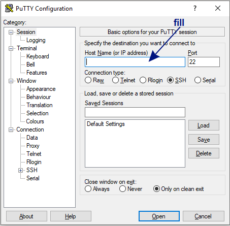
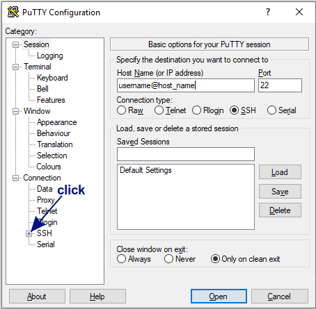
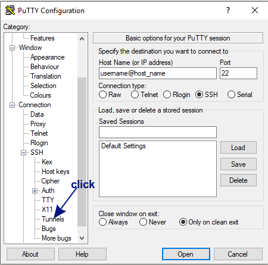
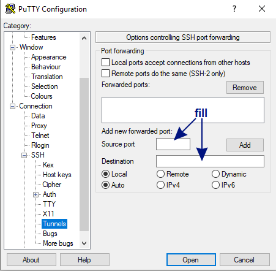
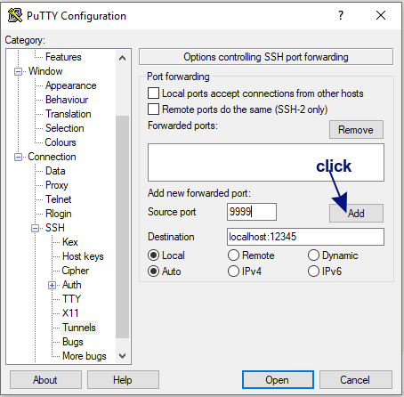
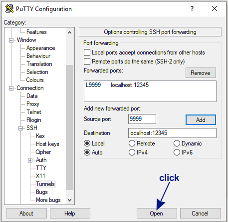
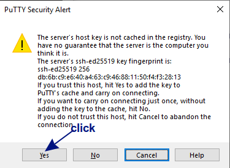

# A good way to install packages

## Virtual enviroment in python
### Intro

`virtualenv` is a tool to create isolated Python environments.

The basic problem being addressed is one of dependencies and versions, and indirectly permissions. Imagine you have an application that needs version 1 of LibFoo, but another application requires version 2. How can you use both these applications? If you install everything into `/usr/lib/python2.7/site-packages` (or whatever your platform’s standard location is), it’s easy to end up in a situation where you unintentionally upgrade an application that shouldn’t be upgraded.

Or more generally, what if you want to install an application and leave it be? If an application works, any change in its libraries or the versions of those libraries can break the application.

Also, what if you can’t install packages into the global `site-packages` directory? For instance, on a shared host.

In all these cases, virtualenv can help you. It creates an environment that has its own installation directories, that doesn’t share libraries with other virtualenv environments (and optionally doesn’t access the globally installed libraries either).

### Usage
`virtualenv` should be already installed.
Let's create new virtual enviroment. For example, let's create enviroment called "my_env":
```
$ virtualenv my_env
```
`my_env` is a directory to place the new virtual environment. The python in your new virtualenv is effectively isolated from the python that was used to create it.

In a newly created virtualenv there will be a `activate` shell script. Run:
```
$ source my_env/bin/activate
```
After this command your terminal would look like:
```
(my_env)$
```
If you see "(my_env)" written before the "$" sign in the terminal, than the `my_env` virtual enviroment has been successfully activated. Now let's install `jupyter` in `my_env`.

## Jupyter Notebook
### Intro
- The *Jupyter Notebook App* is a server-client application that allows editing and running *notebook documents* via a web browser. The Jupyter Notebook App can be executed on a local desktop requiring no internet access or can be installed on a remote server and accessed through the internet.

- *Notebook documents* are documents produced by the *Jupyter Notebook App*, which contain both computer code (e.g. python) and rich text elements (paragraph, equations, figures, links, etc…). Notebook documents are both human-readable documents containing the analysis description and the results (figures, tables, etc..) as well as executable documents which can be run to perform data analysis.

- A notebook *kernel* is a “computational engine” that executes the code contained in a Notebook document. When you open a Notebook document, the associated kernel is automatically launched. When the notebook is executed (either cell-by-cell or with menu Cell -> Run All), the kernel performs the computation and produces the results. Depending on the type of computations, the kernel may consume significant CPU and RAM. Note that the RAM is not released until the kernel is shut-down.

### Usage
To install `jupyter notebook` in `my_env`, type:
```
(my_env)$ pip install jupyter
```
After installation, let's run jupyter notebook. By default jupyter notebook uses port 8888. But this port most likely is already used, so let's choose another one, say, 12345:
```
(my_env)$ jupyter notebook --ip 0.0.0.0 --port 12345
```
If port 12345 is already used, you'll see error:
```
socket.error: [Errno 99] Cannot assign requested address
```
In this case select a different, unused port number until this error stops appearing. It is recommended to use a port greater or equal to 8000 as those port numbers are unlikely to be used by another process.

Now `jupyter notebook` is running on server in virtual enviroment. Let's connect to it from our local machine using web browser. To do it, we have to set `SSH tunneling`.

## SSH tunneling
SSH tunneling is a simple and fast way to connect to the Jupyter Notebook application running on your server. Secure shell (more commonly known as SSH) is a network protocol which enables you to connect to a remote server securely over an unsecured network.

The SSH protocol includes a port forwarding mechanism that allows you to tunnel certain applications running on a specific port number on a server to a specific port number on your local computer. We will learn how to securely "forward" the Jupyter Notebook application running on your server to a port on your local computer.

The method you use for establishing an SSH tunnel will depend on your local computer's operating system. For Windows you have to use `PuTTY`.

## PuTTY
`PuTTY` is an open-source SSH client for Windows which can be used to connect to your server. After downloading and installing `PuTTY` on your Windows machine, you will see this window:



You have to fill the "Host Name (or IP adress)" field using your username and host name like this:



After filling, press the '+' button near field 'SSH' on the left side of the window. Then you will see the 'Tunnels' field. Press it.



Then you will see new fields. You have to fill fields 'Source port' and 'Destination'.



In the field 'Destination' enter 'localhost:12345', since port 12345 is the one that Jupyter Notebook is running on.
In the field 'Source port' enter the port that you want to use to access Jupyter on your local machine (for example, 9999). It is recommended to use a port greater or equal to 8000 as those port numbers are unlikely to be used by another process. If choosen port is used by another process, though, select a different, unused port number.



After filling fields 'Source port' and 'Destination' click button 'Add'. After this new line should appear in 'Forwarded ports' window:



Then ckick the 'open' button to open the connection. After this you may see window like this:



Press the 'Yes' button. Now the connection is established.

## Connect jupyter notebook with browser
When you run jupyter notebook, some lines appeared in the terminal. Found among them one line, that looks like:
```
    Copy/paste this URL into your browser when you connect for the first time,
    to login with a token:
        http://(jump.dev.nbs or 127.0.0.1):12345/?token=e87a50a9ae82e9e002ec10591c1192b110b276e7d3649afb
```

From here copy token and use it to create link. In this example, link should be:
```
http://127.0.0.1:9999/?token=e87a50a9ae82e9e002ec10591c1192b110b276e7d3649afb
```
Every time there would be another token. So, link looks like:
```
http://127.0.0.1:SOURCEPORT/?token=TOKEN
```
Where:
- SOURCEPORT is the number you've entered in the 'Source port' field.
- TOKEN you have to copy from terminal in which jupyter is running.

Paste composed link into your web browser. Now you've connected to jupyter, running on server in virtual enviroment.

## Install other packages

After all this, there are two ways to install packages into our virtual enviroment `my_env`.

1. from virtual enviroment `my_env`.
`my_env` should be activated on server, as discribed above. If already activated `my_env` is busy (for example, your jupyter notebook is running in that terminal), you can open another terminal on server and activate `my_env` one more time. Please, ensure that there is "(my_env)" written before the "$" sign in the terminal where you are going to install package. So terminal should look like:
```
(my_env)$ pip install packagename
```


2. from jupyter. You can type in cell in jupyter notebook: 
```
!pip install packagename
```
and it should work (jupyter notebook should be run from `my_env` on server, as discribed above).


## Usefull links:
- Download `PuTTY`: https://www.putty.org/
- More about virtualenv: https://virtualenv.pypa.io/en/latest/
- Good tutorial, used to create this guide: https://www.digitalocean.com/community/tutorials/how-to-install-run-connect-to-jupyter-notebook-on-remote-server
- Perfect explanation about installing packages from jupyter: https://jakevdp.github.io/blog/2017/12/05/installing-python-packages-from-jupyter/
- More about jupyter: https://jupyter-notebook.readthedocs.io/en/latest/notebook.html#opening-notebooks
- Comprehensive Beginner’s Guide to Jupyter Notebooks for Data Science & Machine Learning: https://www.analyticsvidhya.com/blog/2018/05/starters-guide-jupyter-notebook/
